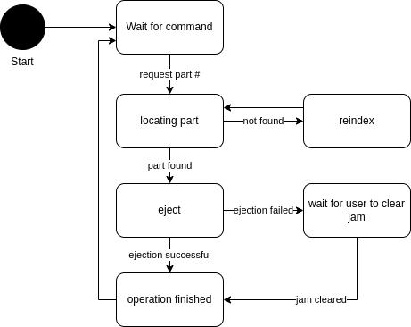

# State Machine Design Pattern Test

This repo is code that demonstrates the State pattern in python.

The class will automatically shift from state to state depending on inputs to handle functions.

To demo this functionality an example scenario has been created.

In this scenario a machine that stores parts at a specific index has the capability to 
eject specific parts at a specific index. A simulator for this machine is in the src folder of 
this repository. It randomly generates an inventory at startup and lets you locate and eject items
from it.

This flow chart describes the state machine and transitions used to define its behavior.

This machine has 6 states:

- WAIT_FOR_COMMAND
- LOCATING_PART
- EJECTING
- REINDEXING
- JAMMED
- FINISHED

The machine does not account for power loss mid operation. 

Please read through the code and code comments in this order:

- main
- MachineSim
- PartStorageStateMachine
- wait_command_state
- locating_state
- reindex_state
- eject_state
- jam_state
- finished_state

This implementation is based off the State pattern described here:

https://refactoring.guru/design-patterns/state/python/example#:~:text=State%20is%20a%20behavioral%20design,of%20acting%20on%20its%20own.

# Usage

Just run `python3 main.py` to start.

Type `h` or `help` for a list of available commands.

First type `ls` to see what items are in the machine and available to retreive.

Pick an item and record its id.

Type `r <id>` to request the id.

If the machine jams (20% chance of jamming), press enter to continue.

